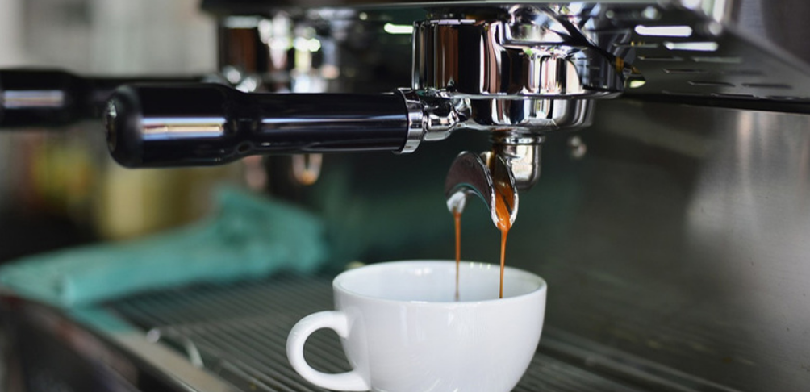

# Coffee Shop Sales Analysis

### Table of Contents:
- [Project Overview](#project-overview)
- [Data Sources](#data-sources)
- [Tools](#tools)
- [Data Preparation](#data-preparation)
- [Exploratory Data Analysis (EDA)](#exploratory-data-analysis)
- [Data Vizualization through Dashboard](#data-vizualization-through-dashboard)
- [Findings](#findings)
  
  - [Key Insights](#key-insights)
  - [Customer Preference Insights](#customer-preference-insights)
  - [Revenue Insights](#revenue-insights)
  - [Location Insights](#location-insights)
- [Recommendations](#recommendations)

### Project Overview

This data analysis project aims to provide insights into the sales and revenue performance of Maven Roasters, a coffee shop chain with three locations in New York City over the first half of the last year. By analyzing various aspects of the sales data, we seek to identify trends, patterns, make data driven decisions, and oppurtunities for the business.

### Data Sources

Sales Data: The primary dataset used for this analysis is the "Coffee Shop Sales.xlsx" file, containing detailed information about each sale and revenue made by the shop.

### Tools

- Microsoft Excel

### Data Preparation

In the initial data preparation phase, we performed the following tasks:
1. Familiarizing with data and inspected data.
2. Added new columns to calculate revenue, month, day of week, hour, weekend/weekday.
3. Data cleaning and formatting.

### Exploratory Data Analysis 

EDA involved exploring the sales data using pivot tables to answer the key questions, such as:

- What is the overall revenue trend by month?
- How many transactions are done by day of week and by hour of day?
- What are the peak sales period?
- Which products are top sellers?
- What are the Top 15 product type s leasding in taransactiond?
- which of the coffe shop loaction generated highest sales and orders?
- How many transactions are done by product category?
- which category plays the main role in revenue contribution?

### Data Vizualization through Dashboard

In the final data vizualization phase, we performed the following tasks:
1. Added Pivot Charts say line chart, column chart, bar chart.
2. Added a slicer and connected to the pivot tables on the sheet.
3. Designed layout for dashboard.
4. Adjusted formatting, alignmentand polish to the dashboard.

### Findings

The analysis results are summarized as follows:

#### Key Insights:

- **Consistent Revenue Growth:** Sales revenue has shown a stable uptrend since February, indicating a healthy business trajectory.
- **Golden Sales Hours:** The period between 8 am to 10 am emerges as the prime time for peak sales every day, signifying a bustling morning rush. However, sales tend to decline during the evening hours, particularly from 6 pm to 8 pm.
- **Peak Sales Time:** The busiest hour, 10 am, is especially prominent on Thursdays, Mondays, and Fridays, suggesting a pattern of heightened activity during weekdays.
- **Weekday vs. Weekend Dynamics:** Weekdays witness higher quantities sold, resulting in noticeable revenue spikes compared to weekends. This trend indicates that a significant portion of regular customers are likely office-goers.

#### Customer Preference Insights:

- **Coffee Dominance:** The coffee category leads in transactions, comprising 39.17% of total transactions across all three locations. Among coffee varieties, gourmet brewed coffee (11.34%) and Baristo espresso (11%) are favored by coffee enthusiasts.
- **Brewed Chai Tea:** Despite the tea category accounting for 30.48% of total transactions, brewed chai tea stands out as the most preferred drink among customers, representing 11.52% of total transactions.

#### Revenue Insights:

- **Coffee Reigns Supreme:** Coffee emerges as the leading revenue contributor at 38.63%, followed closely by tea at 28.11%, underscoring their significance in revenue generation.
- **Top Revenue Products:** Baristo espresso leads the pack, contributing 13.08% to total revenue, followed by brewed chai tea, which contributes 11.03%.
- **Minimal Contribution:** Packaged chocolates and flavors make minimal contributions to revenue, standing at 0.63% and 1.20% respectively, suggesting potential areas for improvement or adjustment.

#### Location Insights:

- **Hells Kitchen Dominance:** Hells Kitchen location boasts the highest sales and orders compared to the other locations, indicating its popularity and profitability.
- **Stable Transactions in Astoria:** Transactions in Astoria remain steady throughout the day, even during closing hours, reflecting a consistent customer base.
- **Fluctuations in Lower Manhattan:** Lower Manhattan experiences fluctuating transaction patterns, witnessing a sharp decline post 6 pm, highlighting potential opportunities for optimization during evening hours.

### Recommendations

Based on the following analysis, we recommend the following actions:
1. **Weekday Revenue Optimization:** Given that weekdays dominate revenue generation, it's prudent to tailor promotions and events to capitalize on the bustling weekday traffic.
2. **Operational Adjustments in Lower Manhattan:** To potentially improve margins in Lower Manhattan, consider adjusting operational hours to close shop after 6 pm, aligning with the observed decline in transactions during evening hours.
3. **Evening Promotions:** Implementing special offers or discounts in the evening could stimulate sales post-peak hours, tapping into untapped potential during traditionally slower periods.
4. **Category Prioritization:** Direct focus towards the main revenue-contributing categories, including coffee (39%), tea (28%), bakery items (12%), drinking chocolate (10%), and coffee beans (6%).
5. **Trimming Non-Performing Categories:** Considering the minimal contribution to revenue, thoughtful consideration should be given to potentially eliminating packaged chocolates and flavors, which contribute only around 0.63% and 1.20% respectively, streamlining offerings to focus on high-impact products.
